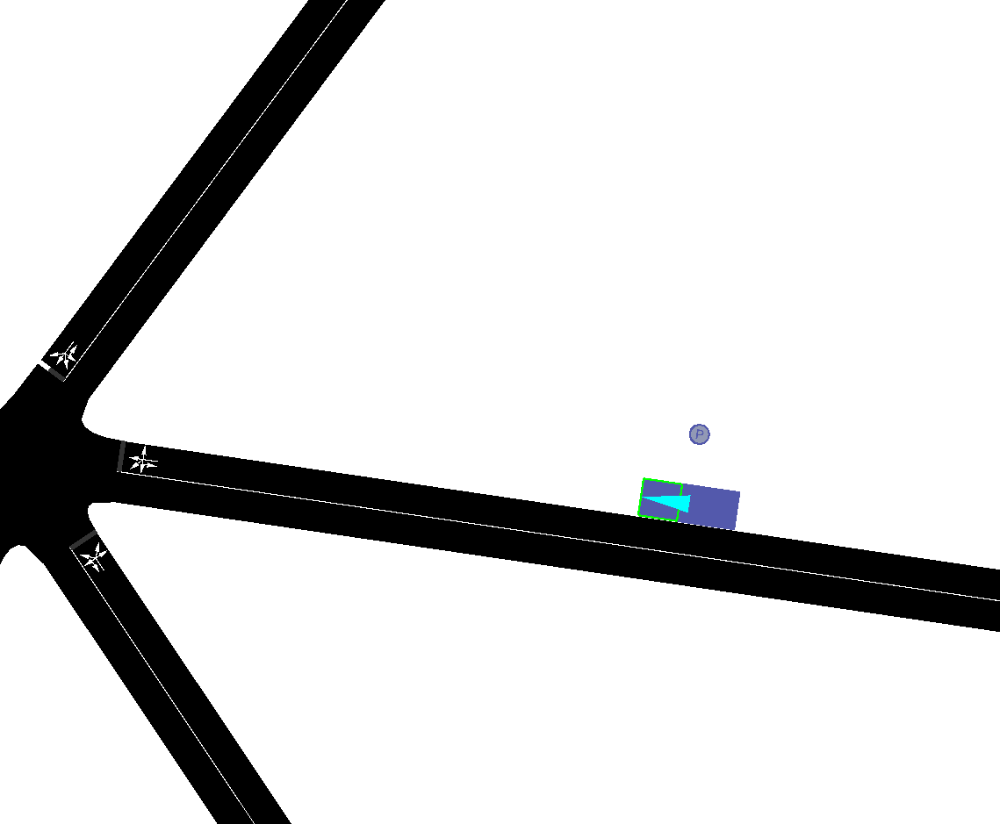

# Sumo Simulation Manager
- Automates the creation and management of Sumo simulations for vehicle communications optimization.

## Analysis transformer
- Requires [RapidXML](https://sourceforge.net/projects/rapidxml/)

## Roadside towers
- Roadside towers are represented by parked cars:


## Setup
- Use `vagrant` to run in a vm
  - Run: `vagrant up && vagrant ssh`
  - In the vm: `cd /vagrant && export SUMO_HOME=/home/vagrant/sumo && make setup`

## Use

### Simulation Manager
- Run example simulation
```bash
make simulate-example
```

- Open example simulation in sumo-gui (can't run in vagrant)
```bash
make gui-example
```

### Creating random networks and vehicles
- Random network
```bash
$SUMO_HOME/bin/netgenerate --rand --rand.iterations=200 --output-file=example.net.xml
```

- Random vehicles and routes
```bash
python $SUMO_HOME/tools/randomTrips.py \
      -n examples/example.net.xml \
      -o examples/example.trip.xml \
      -r examples/example.rou.xml \
      -e 3600 -p 1.0 #defaults
```
